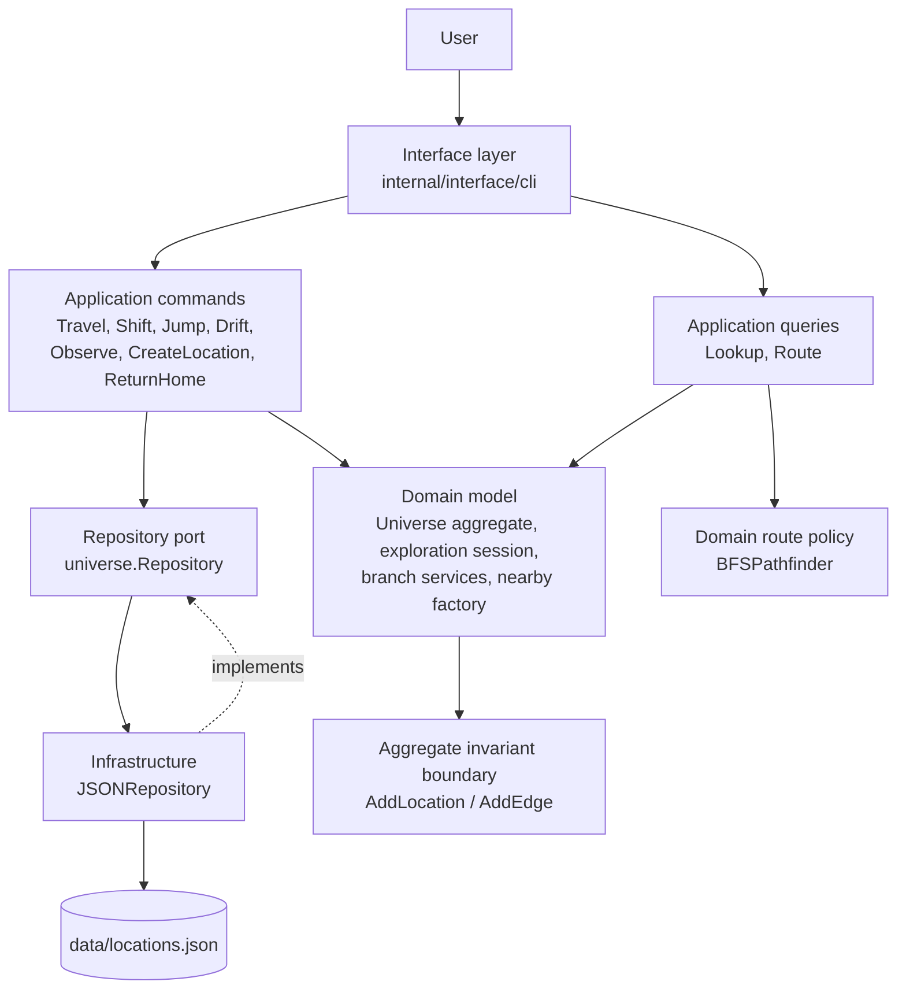

# Domain-Driven Design in Onto

## What DDD is

Domain-Driven Design is an approach to software where the structure of the code mirrors the structure of the problem it solves. The core idea is that the business rules — in this case, the rules of reality navigation — should live in one place, expressed in the language of the domain, free from technical concerns like databases, HTTP, or file formats.

A few terms come up constantly.

**Ubiquitous language.** Everyone working on the code uses the same words for the same things. If the domain says "quantum shift", the code says `QuantumShift`, not `modeType4` or `kind == 7`.

**Bounded context.** A boundary around a coherent set of concepts where the ubiquitous language is consistent. Inside this project there is one bounded context: reality navigation. If the project grew to include user accounts or billing, those would be separate contexts with their own models.

**Aggregate.** A cluster of objects treated as a single unit for the purpose of data changes. One object is the aggregate root — all access to the cluster goes through it. This keeps invariants easy to enforce.

**Entity.** An object with a stable identity over time. Two entities with the same data are still different objects if they have different IDs.

**Value object.** An object with no identity — it is defined entirely by its data. Two value objects with the same data are interchangeable. They should be immutable.

**Domain service.** Logic that doesn't naturally belong on a single entity or value object. Usually operates on multiple aggregates or encodes a process.

**Repository.** An interface, defined in the domain, that abstracts persistence. The domain says "I need to load and save a universe" without knowing or caring whether that means a JSON file, a database, or anything else.

**Application service / use case.** Sits outside the domain. Receives a request, calls domain objects to do the work, and hands the result back. It orchestrates; it does not contain business logic itself.

---

## How DDD is applied here

### Application structure

The solid arrows show runtime calls. The dashed arrow shows an implementation
dependency: infrastructure implements the domain-defined repository port, never
the reverse. The CLI formats results and gathers input; application commands
orchestrate use cases; the domain owns navigation rules and graph invariants.

### The aggregate root — `universe.Aggregate`

`universe.Aggregate` in `internal/domain/universe/universe.go` is the aggregate root. It owns every `LocationEntity` and `EdgeVO` in the graph. Both internal maps are unexported, so nothing outside the struct can add, remove, or corrupt a location or edge directly. All mutations go through `AddLocation` and `AddEdge`; all reads go through `GetLocation`, `EdgesFrom`, `AllLocations`, and `AllEdgesFlat`.

This means the graph can never be left in a half-constructed state by a caller that forgets a step.

### Entities — `LocationEntity`, `exploration.Entity`

`LocationEntity` has a stable ID (lowercase-hyphenated, e.g. `home`, `home-q1`). Two locations with the same coordinates but different IDs are different places. The ID is the identity.

`exploration.Entity` in `internal/domain/exploration/session.go` tracks where the user is right now — current location ID, current coordinate, travel history, and cumulative journey cost. It is an entity because it has a clear identity (it is *this* user's session) and its state changes over time as the user moves. Its movement methods (`MoveTo`, `ShiftTo`, `JumpTo`, `DriftTo`, and `ObserveTo`) each accept a cost and accumulate it into `CumulativeCost`.

### Value objects — `CoordinateVO`, `EdgeVO`, `TravelModeVO`

`CoordinateVO` is a full reality position vector. It has no identity of its own — two coordinates with the same field values describe the same position. It is copied freely, never mutated in place.

`EdgeVO` is a directed connection between two location IDs. It is defined by its data (from, to, mode, cost, distance); there is no "edge #42". Replacing one `EdgeVO` with another that has the same fields is a no-op.

`TravelModeVO` is a string type (`walk`, `quantum`, `timeline`, etc.) — a value object by nature, since two `walk` values are identical.

### Domain services — contextual branching

Creating a quantum, timeline, or consensus branch is not something a `LocationEntity` does to itself, and it is not something `UniverseAggregate` should know the details of. It is a process: create the destination location, materialize coordinate-matched copies of the reachable physical graph, add physical and contextual return edges, and enforce idempotency.

`BranchContextualService` in `internal/domain/universe/branch.go` owns that shared process. `ContextualTransitionSpec` declares the shared transition policy (mode, cost, labels, and descriptions), while the caller supplies the destination coordinate. `BranchQuantumService`, `BranchTimelineService`, `BranchConsensusService`, and `BranchObserverService` provide the policies and destination coordinates for their respective axes. This keeps the aggregate responsible for storing graph state while the domain service protects navigation invariants.

`PathfinderService` in `internal/domain/navigation/pathfinder.go` is a domain
service interface. The supplied `BFSPathfinder` is the domain's route-selection
policy: it finds the route with the fewest traversable transitions while
enforcing reality-boundary rules.

`NewNearbyLocation` is a domain factory that defines how a dead end expands into
a nearby location and its bidirectional physical connections. `TravelCommand`
only reports that a destination is a dead end; `GenerateNearbyLocationCommand`
performs the resulting mutation and persistence. This keeps terminal interaction
and graph mutation out of the same code path.

### Repository — `universe.Repository`

The interface is defined in `internal/domain/universe/repository.go`. It has two methods: `Load` and `Save`. The domain knows it can persist and retrieve a `universe.Aggregate`; it does not know that the current implementation serialises to JSON.

`JSONRepository` in `internal/infrastructure/persistence/json_repository.go` is the only implementation. Swapping it for a database implementation would not touch a single line of domain code.

`scripts/validate_locations.go`, invoked with `make validate-locations`, is an operational integrity check for the persisted JSON graph. It validates location identities, edge references, and the domain rule that physical edges cannot cross reality contexts; it does not mutate the aggregate or replace the repository.

### Application layer — commands and queries (CQRS)

The application layer in `internal/application/` contains use cases, not business rules.

**Commands** (in `commands/`) mutate state and persist the result:
- `TravelCommand` — validates a physical route, moves the session, accumulates cost, handles dead ends, saves.
- `ShiftCommand` — calls `BranchQuantumService`, moves the session, accumulates quantum shift cost, saves.
- `JumpCommand` — calls `BranchTimelineService`, moves the session, accumulates timeline shift cost, saves.
- `DriftCommand` — calls `BranchConsensusService`, moves the session, accumulates consensus-transition cost, saves.
- `ObserveCommand` — calls `BranchObserverService`, moves the session, accumulates observer-shift cost, saves.

**Queries** (in `queries/`) are pure reads with no side effects:
- `LookupQuery` — `Where`, `Look`, `List`.
- `RouteQuery` — plans a route without moving the session.

`ReturnHomeCommand` in the application layer orchestrates multiple commands in
sequence (repeated `ObserveCommand` returns, `DriftCommand` alignment,
`JumpCommand` back, `ShiftCommand` back, then `TravelCommand` to the start
location). The CLI asks for confirmation and formats the command's plan and
result, but contains none of the return-home workflow.

Commands and queries each return a result struct. The interface layer formats that struct for the terminal; the application layer never touches a string.

### Interface layer — `cli`

`internal/interface/cli/` is the delivery mechanism. It knows about `bufio`, `fmt`, and the terminal. The domain has no knowledge that a CLI exists. Replacing the CLI with an HTTP API or a TUI would mean writing a new `interface/` package and leaving everything else untouched.

### Type-name suffixes

Every exported domain type carries its role as a suffix — `Aggregate`, `Entity`, `VO`, `Service`, `Repository`, or `Spec`. This makes the role visible at the call site without needing to look up the definition. When you see `universe.CoordinateVO` in application code, you know immediately that it is a value object defined in the domain.
