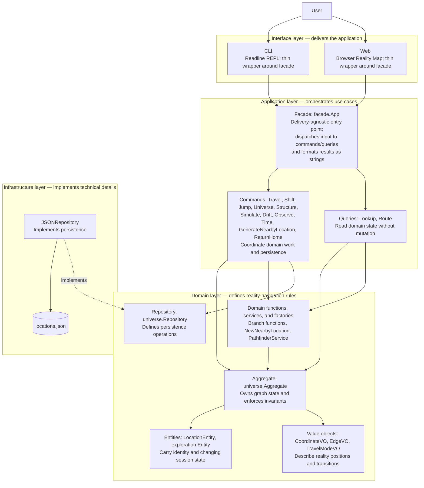

# Domain-Driven Design in Onto

## What DDD is

Domain-Driven Design is an approach to software where the structure of the code mirrors the structure of the problem it solves. The core idea is that the business rules — in this case, the rules of reality navigation — should live in one place, expressed in the language of the domain, free from technical concerns like databases, HTTP, or file formats.

A few terms come up constantly.

**Ubiquitous language.** Everyone working on the code uses the same words for the same things. If the domain says "quantum shift", the code says `QuantumShift`, not `modeType4` or `kind == 7`.

**Bounded context.** A boundary around a coherent set of concepts where the ubiquitous language is consistent. Inside this project there is one bounded context: reality navigation. If the project grew to include user accounts or billing, those would be separate contexts with their own models.

**Aggregate.** A cluster of objects treated as a single unit for the purpose of data changes. One object is the aggregate root — all access to the cluster goes through it. This keeps invariants easy to enforce.

**Entity.** An object with a stable identity over time. Two entities with the same data are still different objects if they have different IDs.

**Value object.** An object with no identity — it is defined entirely by its data. Two value objects with the same data are interchangeable. They should be immutable.

**Domain service.** Logic that doesn't naturally belong on a single entity or value object. Usually operates on multiple aggregates or encodes a process.

**Repository.** An interface, defined in the domain, that abstracts persistence. The domain says "I need to load and save a universe" without knowing or caring whether that means a JSON file, a database, or anything else.

**Application service / use case.** Sits outside the domain. Receives a request, calls domain objects to do the work, and hands the result back. It orchestrates; it does not contain business logic itself.

---

## How DDD is applied here

### Application structure

The domain layer contains all business meaning: aggregate invariants, entity
state, value-object definitions, domain processes, and repository abstraction.
Application code coordinates those concepts into use cases; it does not define
reality-navigation rules. The application facade is the single entry point for
all delivery mechanisms — it receives a plain string, dispatches to the
appropriate command or query, and returns a formatted string. The interface
packages (CLI and web) are thin wrappers that handle I/O and delegate
everything else to the facade; neither knows the other exists. Infrastructure
supplies the JSON persistence implementation. The dashed arrow is dependency
inversion: the outer JSON repository implements the domain-defined repository
abstraction.

### The aggregate root — `universe.Aggregate`

`universe.Aggregate` in `internal/domain/universe/universe.go` is the aggregate root. It owns every `LocationEntity` and `EdgeVO` in the graph. Both internal maps are unexported, so nothing outside the struct can add, remove, or corrupt a location or edge directly. All mutations go through `AddLocation` and `AddEdge`; all reads go through `GetLocation`, `EdgesFrom`, `AllLocations`, and `AllEdgesFlat`.

This means the graph can never be left in a half-constructed state by a caller that forgets a step.

### Entities — `LocationEntity`, `exploration.Entity`

`LocationEntity` has a stable ID (lowercase-hyphenated, e.g. `home`, `home-q1`). Two locations with the same coordinates but different IDs are different places. The ID is the identity.

`exploration.Entity` in `internal/domain/exploration/session.go` tracks where the user is right now — current location ID, current coordinate, travel history, and cumulative journey cost. It is an entity because it has a clear identity (it is *this* user's session) and its state changes over time as the user moves. Its movement methods (`MoveTo`, `ShiftTo`, `JumpTo`, `DriftTo`, and `ObserveTo`) each accept a cost and accumulate it into `CumulativeCost`.

### Value objects — `CoordinateVO`, `EdgeVO`, `TravelModeVO`

`CoordinateVO` is a full reality position vector. It has no identity of its own — two coordinates with the same field values describe the same position. It is copied freely, never mutated in place.

`EdgeVO` is a directed connection between two location IDs. It is defined by its data (from, to, mode, cost, distance); there is no "edge #42". Replacing one `EdgeVO` with another that has the same fields is a no-op.

`TravelModeVO` is a string type (`walk`, `quantum`, `timeline`, etc.) — a value object by nature, since two `walk` values are identical.

### Domain functions — contextual branching

Creating a quantum, timeline, or consensus branch is not something a `LocationEntity` does to itself, and it is not something `UniverseAggregate` should know the details of. It is a process: create the destination location, materialize coordinate-matched copies of the reachable physical graph, add physical and contextual return edges, and enforce idempotency.

`BranchContextual` in `internal/domain/universe/branch.go` owns that shared process. `ContextualTransitionSpec` declares the shared transition policy (mode, cost, optional reverse cost, labels, and descriptions), while the caller supplies the destination coordinate. `BranchQuantum`, `BranchTimeline`, `BranchUniverse`, `BranchMathematics`, `BranchSimulation`, `BranchConsensus`, and `BranchObserver` provide the policies and destination coordinates for their respective axes. This keeps the aggregate responsible for storing graph state while these stateless domain functions protect navigation invariants. They are plain package-level functions rather than services — they have no dependencies to inject and no interface to swap, so the `Service` suffix would misleadingly imply otherwise.

`PathfinderService` in `internal/domain/navigation/pathfinder.go` is a genuine domain
service: it is an interface with a swappable implementation (`BFSPathfinder`),
injected into callers rather than called as a free function. The supplied
`BFSPathfinder` is the domain's route-selection policy: it finds the route with
the fewest traversable transitions while enforcing reality-boundary rules.

`NewNearbyLocation` is a domain factory that defines how a dead end expands into
a nearby location and its bidirectional physical connections. `TravelCommand`
only reports that a destination is a dead end; `GenerateNearbyLocationCommand`
performs the resulting mutation and persistence. This keeps terminal interaction
and graph mutation out of the same code path.

### Repository — `universe.Repository`

The interface is defined in `internal/domain/universe/repository.go`. It has two methods: `Load` and `Save`. The domain knows it can persist and retrieve a `universe.Aggregate`; it does not know that the current implementation serialises to JSON.

`JSONRepository` in `internal/infrastructure/persistence/json_repository.go` is the only implementation. Swapping it for a database implementation would not touch a single line of domain code.

`scripts/validate_locations.go`, invoked with `make validate-locations`, is an operational integrity check for the persisted JSON graph. It validates location identities, edge references, and the domain rule that physical edges cannot cross reality contexts; it does not mutate the aggregate or replace the repository.

### Application layer — facade, commands, and queries (CQRS)

The application layer in `internal/application/` contains use cases, not business rules. It has three sub-packages: `facade/` is the public entry point for all delivery mechanisms; `commands/` and `queries/` are the individual use cases that the facade dispatches to.

**Commands** (in `commands/`) mutate state and persist the result:
- `TravelCommand` — validates a physical route, moves the session, accumulates cost, handles dead ends, saves.
- `ShiftCommand` — calls `BranchQuantum`, moves the session, accumulates quantum shift cost, saves.
- `JumpCommand` — calls `BranchTimeline`, moves the session, accumulates timeline shift cost, saves.
- `UniverseCommand` — calls `BranchUniverse`, moves the session, accumulates bubble-universe shift cost, saves.
- `StructureCommand` — calls `BranchMathematics`, moves the session, accumulates mathematical-structure shift cost, saves.
- `SimulateCommand` — calls `BranchSimulation`, moves the session, accumulates simulation entry/exit cost, saves.
- `DriftCommand` — calls `BranchConsensus`, moves the session, accumulates consensus-transition cost, saves.
- `ObserveCommand` — calls `BranchObserver`, moves the session, accumulates observer-shift cost, saves.
- `TimeCommand` — calls `BranchTime`, moves the session to an RFC3339 timestamp, accumulates temporal-shift cost, saves.

**Queries** (in `queries/`) are pure reads with no side effects:
- `LookupQuery` — `Where`, `Look`, `List`.
- `RouteQuery` — plans a route without moving the session.

`ReturnHomeCommand` in the application layer orchestrates multiple commands in
sequence (repeated `ObserveCommand` returns, `DriftCommand` alignment,
`SimulateCommand` exits, `TimeCommand` returns, `JumpCommand` back, `ShiftCommand`
back, `UniverseCommand` back, `StructureCommand` back, then `TravelCommand` to the
start location). The facade's `GoHome` and `GoHomeConfirm` methods format the
plan and result; the interface layer only asks for confirmation and prints the
returned strings.

Commands and queries each return a result struct. The facade formats that struct into a string; the application layer (commands and queries) never touches a string, and the interface layer never interprets the content of one.

### Interface layer — `cli` and `web`

`internal/interface/cli/` and `internal/interface/web/` are the delivery mechanisms. Each is a thin wrapper that owns only I/O: the CLI manages a readline REPL and tab-completion; the web interface serves a browser-based Reality Map over a JSON API. Both delegate all command dispatch and output formatting to `internal/application/facade/`. Neither knows the other exists. The domain has no knowledge that any delivery mechanism exists. Adding a new delivery mechanism (HTTP API, gRPC server, another UI) means writing a new `interface/` package and leaving everything else untouched.

### Example: tracing a `travel station` command through the layers

Walking one request end-to-end shows how the layers hand off to each other
without leaking responsibilities across boundaries.

1. **Interface layer.** The user types `travel station`. The delivery mechanism
   (CLI or web) passes the raw string to `facade.App.Execute` (in
   `internal/application/facade/commands.go`). The interface layer's only job is
   I/O — it does not parse commands, validate arguments, or format output.
2. **Interface → Application facade.** `facade.App.Execute` splits the input
   into command `travel` and argument `station`, then dispatches to the facade's
   internal `Travel("station")` method. `Travel` constructs a
   `commands.TravelCommand`, wiring in the current `*universe.Aggregate`, the
   user's `*exploration.Entity` session, and the injected
   `navigation.PathfinderService`. It calls `cmd.Execute("station")`. The facade
   does not know *how* a route is found or *what* makes a location reachable —
   it only knows how to invoke the command and format whatever it returns.
3. **Application → Domain (read).** `TravelCommand.Execute` normalises the
   target to a location ID (`station`), confirms it exists via
   `Universe.GetLocation`, then asks the injected `Pathfinder.FindRoute` (the
   `BFSPathfinder` domain service) for the shortest path of `EdgeVO`s from the
   session's current location to `station`.
4. **Domain rule enforcement.** Still inside `TravelCommand.Execute`, each edge
   in the returned path is checked against domain rules: `EdgeVO.Mode.IsPhysical()`
   must hold, and both endpoints' `CoordinateVO`s must satisfy
   `SamePhysicalReality`. This is where the domain concept "normal travel
   cannot cross reality boundaries" is enforced — the application layer relies
   on the domain to decide what is legal, it does not reimplement the rule.
5. **Domain → Application (write).** Once the route passes validation,
   `TravelCommand` sums the path's edge costs and calls
   `Session.MoveTo(loc, pathCost)` on the `exploration.Entity`, which updates
   the entity's current location, appends to its travel history, and
   accumulates `CumulativeCost`. `TravelCommand` also calls the package-level
   `isDeadEnd` helper to check whether `station` has any outgoing physical
   edge other than the one just arrived from.
6. **Result back to facade.** `TravelCommand.Execute` returns a `TravelResult`
   (destination `LocationEntity`, traversed `Path`, outgoing `Edges`, updated
   `History`, and a `DeadEndHandled` flag) — plain data, no strings.
   `facade.App.Travel` passes it to `formatTravelResult` (in
   `internal/application/facade/display.go`), which renders the arrival message,
   cumulative cost, and possible onward journeys as a plain string. That string
   is returned all the way back to the interface layer, which prints it verbatim.
7. **Dead-end branch (conditional).** If `DeadEndHandled` is true, `facade.App.Travel`
   runs a second use case, `commands.GenerateNearbyLocationCommand`, which
   uses the domain factory `NewNearbyLocation` to materialise a new location
   and bidirectional edges from `station`, then persists the updated universe
   via the `Repository`. This keeps "report a dead end" (a read-like concern
   inside `TravelCommand`) separate from "expand the graph" (a distinct
   mutating use case), even though both are triggered by the same user input.

At no point does the CLI or web decide what counts as a valid route. At no
point does the domain know it is being driven by a terminal. And at no point
does the facade know whether the caller is a readline REPL, a browser,
or a test. That separation is the practical payoff of the layering
described above.

### Type-name suffixes

Every exported domain type carries its role as a suffix — `Aggregate`, `Entity`, `VO`, `Service`, `Repository`, or `Spec`. This makes the role visible at the call site without needing to look up the definition. When you see `universe.CoordinateVO` in application code, you know immediately that it is a value object defined in the domain. The `Service` suffix is reserved for genuine services — interfaces with swappable implementations, such as `PathfinderService` — and is deliberately omitted from stateless domain functions like `BranchQuantum` or `BranchTimeline`, which are plain functions, not services.
